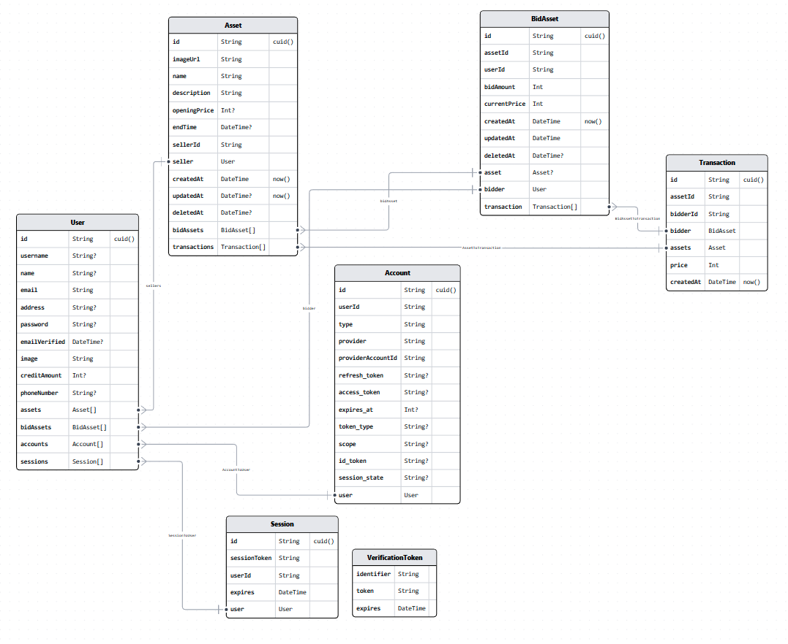

# Markilang: Mari Kita Lelang

MARKILANG provides auction services for those wanting to auction small valuables or rare collectibles and provides an online platform for collectors to bid their favourite selections.

## Team Members

| Name                | Main Role                 |
| :------------------ | :------------------------ |
| Derian Melvin       | Lead & Frontend Developer |
| Rafael Jonathan     | Frontend Developer        |
| Mahdi Harish Rahman | Backend Developer         |
| Nofrialdi           | Backend Developer         |
| Ichsan Zulfikar     | Backend Developer         |

## Tech Stack

### Front-end

- Nextjs
- Tailwind
- SWR
- Axios
- Yup
- React Hook Form

### Back-end

- Nextjs
- Prisma
- Postgres
- Vercel
- Railway

## Data Model

