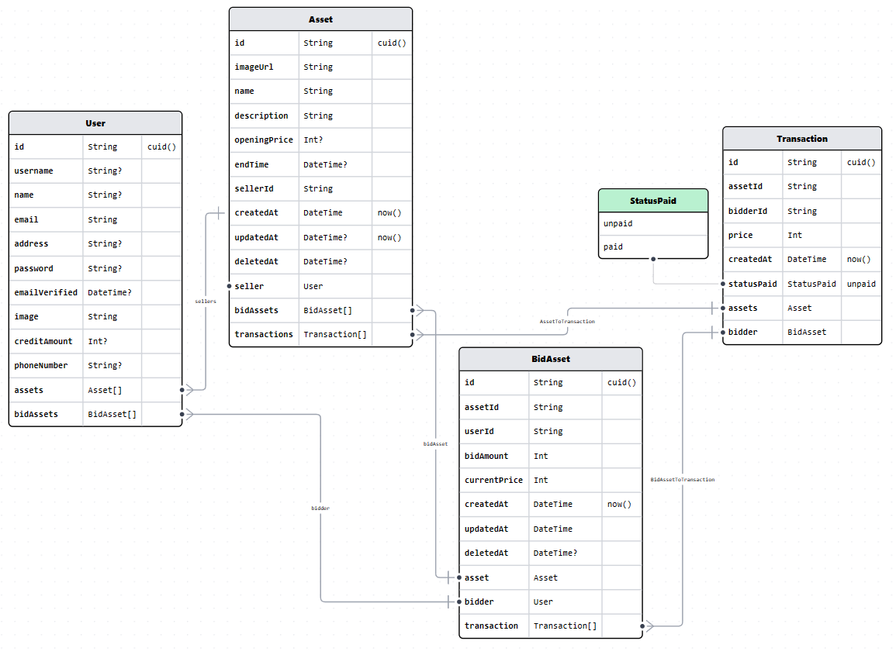

# Markilang: Mari Kita Lelang

MARKILANG provides auction services for those wanting to auction small valuables or rare collectibles and provides an online platform for collectors to bid their favourite selections.

## Links

-   Website: [Markilang](https://www.markilang.online/)
-   Figma: [Markilang](https://www.figma.com/file/o53EEp55ijq0FK2oxSlSWn/RevoU-Final-Project---Group-2?type=design&node-id=0-1&mode=design&t=B9ytkCri1mgdYgJS-0)
-   GitHub: [Markilang](https://github.com/revou-fsse-1/w24-group-final-group-2)

## Team Members

| Name                | Main Role                 |
| :------------------ | :------------------------ |
| Derian Melvin       | Lead & Frontend Developer |
| Rafael Jonathan     | Frontend Developer        |
| Mahdi Harish Rahman | Backend Developer         |
| Nofrialdi           | Backend Developer         |
| Ichsan Zulfikar     | Backend Developer         |

## Tech Stack

### Front-end

-   Nextjs
-   Tailwind
-   SWR
-   Axios
-   Yup
-   React Hook Form

### Back-end

-   Nextjs
-   Prisma
-   Postgres
-   Vercel
-   Railway

## Data Model

